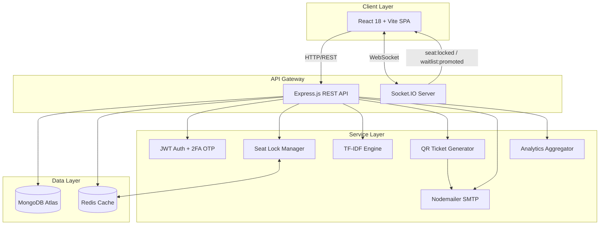
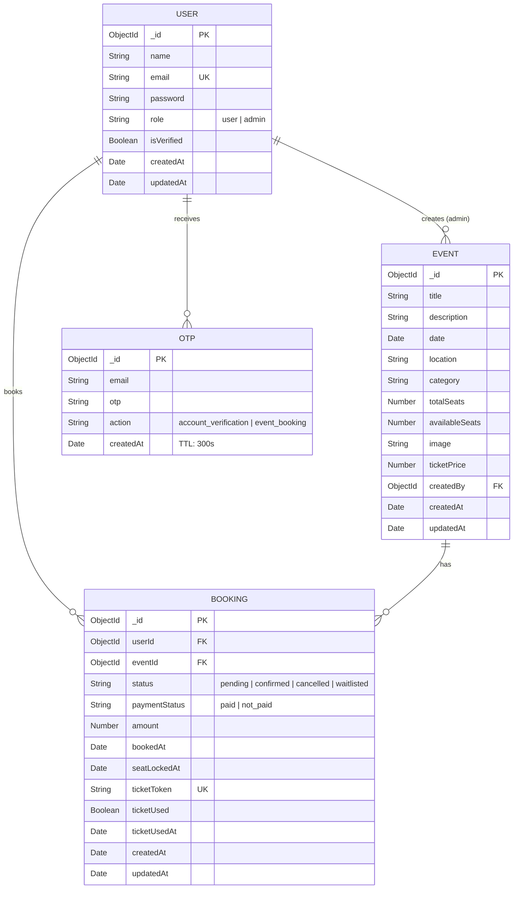
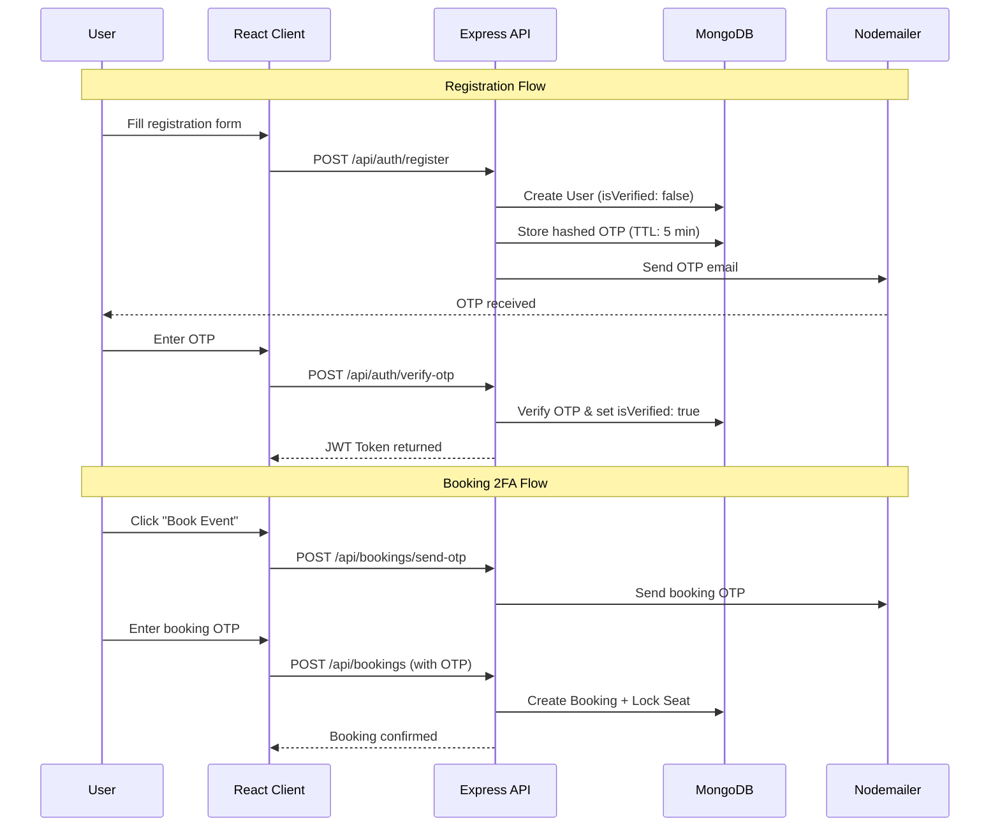

<div align="center">

  <!-- Logo -->
  

  <h1>Evenzo — Advanced Event Booking Platform</h1>
  <p><em>A production-grade, highly concurrent MERN stack event management system featuring real-time seat locking, cryptographic QR E-Ticketing, a Redis-backed waitlist, an admin analytics dashboard, and a custom TF-IDF recommendation engine — all built from scratch.</em></p>

  <br />

  <!-- Tech Badges -->
  
  
  
  
  
  
  
  
  

  <br /><br />

  <!-- Status Badges -->
  
  
  

</div>

---

## 📖 Project Overview

**Evenzo** is a full-stack, end-to-end event booking platform engineered from the ground up for **high concurrency**, **real-time collaboration**, and **secure data handling**. Rather than relying on third-party SaaS tools, every critical subsystem — from the NLP recommendation engine to the cryptographic ticketing pipeline — is implemented as a first-party module.

**For Organizers:** A powerful admin dashboard with MongoDB aggregation-powered analytics, event CRUD, and booking queue management.

**For Attendees:** A seamless real-time booking experience with live seat availability, QR-coded PDF e-tickets delivered via email, and personalized event recommendations.

---

## 🎯 Problem Statement

Standard event booking systems fail under real-world pressure:

| Problem | How Evenzo Solves It |
| :--- | :--- |
| **Race conditions** during high-traffic ticket drops | Redis-backed FIFO waitlist (`ZADD`/`ZPOPMIN`) + Socket.IO real-time seat locking eliminates double-booking |
| **Ticket fraud** and duplication at venue gates | Cryptographic UUID-based QR codes with one-time-use validation |
| **Poor new-user experience** (cold start) | Custom TF-IDF engine with a trending-events fallback for users with no booking history |
| **No real-time feedback** — users refreshing pages | Full WebSocket integration for instant seat status broadcasts |
| **Lack of actionable insights** for organizers | MongoDB aggregation pipelines powering revenue, category, and peak-hour analytics |

---

## ✨ Core Features

### 🔐 Authentication & Security
- Secure JWT-based session management with Bearer token authorization
- **Two-Factor OTP verification** for both account registration and ticket checkout
- Passwords hashed with `bcryptjs` (salted)
- OTPs auto-expire in 5 minutes via MongoDB TTL index
- Role-based access control (`user` / `admin`)

### 💺 Real-Time Seat Locking
- WebSocket-powered (`Socket.IO`) instant seat hold broadcasts (`seat:locked` / `seat:released`)
- 10-minute TTL seat locks with automatic stale-lock recovery on server restart
- In-memory lock map with transactional-style atomic seat decrement

### 📋 Redis Waitlist (FIFO Queue)
- `ZADD waitlist:<eventId> <timestamp> <userId>` — join the queue
- `ZPOPMIN` — auto-promote the longest-waiting user when a cancellation occurs
- Real-time `waitlist:promoted` WebSocket event + email notification to promoted user

### 🎟️ QR E-Ticketing
- Cryptographically random UUID ticket tokens (`crypto.randomUUID()`) prevent forgery
- PDF tickets generated server-side with `PDFKit` + embedded QR code
- Delivered automatically via `Nodemailer` SMTP
- One-time scan validation endpoint (`POST /api/tickets/verify`)

### 🧠 TF-IDF Recommendation Engine
- **Zero external ML libraries** — pure Node.js implementation
- Builds corpus from event `title + description + category`
- Tokenization → Stopword removal → TF-IDF vectorization
- User profile = averaged TF-IDF vectors of past bookings
- Cosine Similarity ranking of all unbooked events
- **Cold start fallback:** trending events (most bookings) for new users

### 📊 Admin Analytics Dashboard
- Revenue over time (grouped by day)
- Bookings per event breakdown
- Cancellation rate tracking
- Peak booking hours heatmap
- Category distribution analysis
- All powered by **MongoDB Aggregation Pipelines** (`$group`, `$lookup`, `$project`)
- Visualized with **Recharts** (bar, line, and pie charts)

---

## 🛠️ Tech Stack

<details open>
<summary><strong>Click to expand full Tech Stack</strong></summary>

| Layer | Technology | Purpose |
| :--- | :--- | :--- |
| **Frontend** | React 18, Vite 5 | SPA with hot module replacement |
| **Styling** | Tailwind CSS 3, PostCSS, Autoprefixer | Utility-first responsive design |
| **Routing** | React Router DOM v6 | Client-side navigation |
| **Charts** | Recharts | Analytics data visualization |
| **Icons** | React Icons | UI iconography |
| **Backend** | Node.js, Express.js | REST API server |
| **Database** | MongoDB, Mongoose 8 | Document store with ODM |
| **Cache / Queue** | Redis 6 (Sorted Sets) | Waitlist FIFO queue |
| **Real-Time** | Socket.IO 4 | WebSocket bi-directional events |
| **Auth** | JWT, Bcrypt.js | Token-based auth + password hashing |
| **Email** | Nodemailer | SMTP transactional emails (OTP + tickets) |
| **PDF Generation** | PDFKit | Server-side ticket PDF creation |
| **QR Codes** | QRCode (npm) | Ticket QR code generation |
| **Dev Tools** | Nodemon, Concurrently, ESLint | DX tooling |

</details>

---

## 🏗️ System Architecture



---

## 🗄️ Database Schema Overview



---

## 🔒 Authentication Flow



---

## ⚙️ Installation Guide

### Prerequisites

| Software | Version | Required |
| :--- | :--- | :---: |
| Node.js | v18+ | ✅ |
| MongoDB | v6+ (or Atlas) | ✅ |
| Redis | v6+ | ✅ |
| npm | v9+ | ✅ |

### Setup

```bash
# 1. Clone the repository
git clone https://github.com/yourusername/Evenzo-MERN.git
cd Evenzo-MERN

# 2. Install all dependencies (client + server)
npm run install:all

# 3. Seed the database with sample data (optional)
npm run seed --prefix server
```

---

## 🔑 Environment Variables

Create a `.env` file inside the `server/` directory:

```env
# ──── Database ────
MONGO_URI=mongodb://localhost:27017/evenzo

# ──── Redis ────
REDIS_URL=redis://localhost:6379

# ──── Authentication ────
JWT_SECRET=your_super_secret_jwt_key_here

# ──── Email (SMTP) ────
EMAIL_USER=your_smtp_email@gmail.com
EMAIL_PASS=your_google_app_password

# ──── Server ────
PORT=5000
```

> [!TIP]
> For Gmail, generate an [App Password](https://myaccount.google.com/apppasswords) instead of using your real password.

---

## 🚀 Running the Project

```bash
# Run both client & server concurrently
npm run dev

# Or run individually:
npm run dev:server    # Backend on http://localhost:5000
npm run dev:client    # Frontend on http://localhost:5173
```

| Service | URL | Description |
| :--- | :--- | :--- |
| Frontend | `http://localhost:5173` | React SPA (Vite HMR) |
| Backend API | `http://localhost:5000` | Express REST API |
| WebSocket | `ws://localhost:5000` | Socket.IO connection |

---

## 📡 API Reference

<details open>
<summary><strong>Authentication</strong> — <code>/api/auth</code></summary>

| Method | Endpoint | Description | Auth |
| :---: | :--- | :--- | :---: |
| `POST` | `/api/auth/register` | Register new user & send verification OTP | ❌ |
| `POST` | `/api/auth/login` | Login with email & password | ❌ |
| `POST` | `/api/auth/verify-otp` | Verify email OTP (registration or booking) | ❌ |

</details>

<details open>
<summary><strong>Events</strong> — <code>/api/events</code></summary>

| Method | Endpoint | Description | Auth |
| :---: | :--- | :--- | :---: |
| `GET` | `/api/events` | List all events | ❌ |
| `GET` | `/api/events/:id` | Get single event details | ❌ |
| `POST` | `/api/events` | Create a new event | 🔒 Admin |
| `PUT` | `/api/events/:id` | Update an event | 🔒 Admin |
| `DELETE` | `/api/events/:id` | Delete an event | 🔒 Admin |

</details>

<details open>
<summary><strong>Bookings</strong> — <code>/api/bookings</code></summary>

| Method | Endpoint | Description | Auth |
| :---: | :--- | :--- | :---: |
| `POST` | `/api/bookings/send-otp` | Send booking 2FA OTP | 🔒 User |
| `POST` | `/api/bookings` | Book an event (with OTP + seat lock) | 🔒 User |
| `GET` | `/api/bookings/my` | Get current user's bookings | 🔒 User |
| `PUT` | `/api/bookings/:id/confirm` | Confirm a pending booking | 🔒 Admin |
| `DELETE` | `/api/bookings/:id` | Cancel booking (triggers waitlist pop) | 🔒 User |

</details>

<details open>
<summary><strong>Tickets</strong> — <code>/api/tickets</code></summary>

| Method | Endpoint | Description | Auth |
| :---: | :--- | :--- | :---: |
| `POST` | `/api/tickets/verify` | Verify & mark QR ticket as used (gate scan) | 🔒 User |

</details>

<details open>
<summary><strong>Analytics</strong> — <code>/api/analytics</code></summary>

| Method | Endpoint | Description | Auth |
| :---: | :--- | :--- | :---: |
| `GET` | `/api/analytics/revenue` | Revenue aggregated over time periods | 🔒 Admin |
| `GET` | `/api/analytics/events` | Booking count per event | 🔒 Admin |
| `GET` | `/api/analytics/cancellations` | Cancellation rate metrics | 🔒 Admin |
| `GET` | `/api/analytics/peak-hours` | Peak booking hours distribution | 🔒 Admin |
| `GET` | `/api/analytics/categories` | Bookings grouped by event category | 🔒 Admin |

</details>

<details open>
<summary><strong>Recommendations</strong> — <code>/api/recommendations</code></summary>

| Method | Endpoint | Description | Auth |
| :---: | :--- | :--- | :---: |
| `GET` | `/api/recommendations` | TF-IDF personalized event suggestions | 🔒 User |

</details>

---

## 📂 Project Structure

<details>
<summary><strong>Click to expand full folder structure</strong></summary>

```text
Evenzo-MERN/
│
├── client/                          # ── React Frontend (Vite) ──
│   ├── src/
│   │   ├── components/
│   │   │   └── Navbar.jsx           # Global navigation bar
│   │   ├── context/                 # React Context providers (Auth)
│   │   ├── pages/
│   │   │   ├── Home.jsx             # Event listing + search
│   │   │   ├── EventDetail.jsx      # Single event + booking flow
│   │   │   ├── Login.jsx            # Login with JWT
│   │   │   ├── Register.jsx         # Registration + OTP verification
│   │   │   ├── UserDashboard.jsx    # User bookings & recommendations
│   │   │   ├── AdminDashboard.jsx   # Admin panel (events + analytics + bookings)
│   │   │   ├── PaymentSuccess.jsx   # Payment confirmation page
│   │   │   └── PaymentFailed.jsx    # Payment failure page
│   │   ├── utils/                   # Axios interceptors & helpers
│   │   ├── App.jsx                  # Router configuration
│   │   ├── main.jsx                 # Entry point
│   │   └── index.css                # Global styles
│   ├── index.html
│   ├── vite.config.js
│   ├── tailwind.config.js
│   └── package.json
│
├── server/                          # ── Express Backend ──
│   ├── controllers/
│   │   ├── authController.js        # Register, Login, OTP verification
│   │   ├── eventController.js       # CRUD operations for events
│   │   ├── bookingController.js     # Book, confirm, cancel + waitlist integration
│   │   ├── ticketController.js      # QR ticket verification at gate
│   │   ├── analyticsController.js   # MongoDB aggregation queries
│   │   └── recommendationController.js  # TF-IDF cosine similarity engine
│   ├── middleware/
│   │   └── auth.js                  # JWT protect + admin role guard
│   ├── models/
│   │   ├── User.js                  # User schema (role, isVerified)
│   │   ├── Event.js                 # Event schema (seats, price, category)
│   │   ├── Booking.js               # Booking schema (status, payment, ticket)
│   │   └── OTP.js                   # OTP schema (TTL: 5 min auto-expire)
│   ├── routes/
│   │   ├── auth.js                  # /api/auth/*
│   │   ├── events.js                # /api/events/*
│   │   ├── bookings.js              # /api/bookings/*
│   │   ├── tickets.js               # /api/tickets/*
│   │   ├── analytics.js             # /api/analytics/*
│   │   └── recommendations.js       # /api/recommendations
│   ├── utils/
│   │   ├── tfidf.js                 # Custom TF-IDF + Cosine Similarity engine
│   │   ├── seatLock.js              # In-memory seat lock manager (TTL recovery)
│   │   ├── socket.js                # Socket.IO initialization & events
│   │   ├── waitlist.js              # Redis sorted set waitlist operations
│   │   ├── redis.js                 # Redis client connection
│   │   ├── ticket.js                # QR + PDF ticket generation (PDFKit)
│   │   └── email.js                 # Nodemailer SMTP transporter
│   ├── seed.js                      # Database seeder (sample events + users)
│   ├── server.js                    # App entry point
│   └── package.json
│
├── Evenzo_Postman_Collection.json   # Pre-built API collection for testing
├── dfd.png                          # Data Flow Diagram
├── fc.png                           # Flow Chart
├── SETUP_GUIDE.md                   # Detailed setup instructions
├── package.json                     # Root workspace (concurrently)
└── README.md
```

</details>

---

## 📸 Screenshots

> [!NOTE]
> Replace placeholder URLs below with actual screenshots of your deployed application.

| View | Preview |
| :---: | :---: |
| **Home — Event Listing** |  |
| **Event Detail + Booking** |  |
| **User Dashboard** |  |
| **Admin Analytics** |  |
| **OTP Verification** |  |

---

## 🤖 Smart Features — Deep Dive

<details>
<summary><strong>🧠 TF-IDF Recommendation Engine — How It Works</strong></summary>

To avoid bulky Python/ML microservices, the entire NLP pipeline runs in **pure Node.js**:

```
1. CORPUS BUILDING
   Each event → "title + description + category" → single text document

2. TOKENIZATION & STOPWORD REMOVAL
   "Annual Tech Conference in Bangalore" → ["annual", "tech", "conference", "bangalore"]

3. TF-IDF VECTORIZATION
   Term Frequency × Inverse Document Frequency → weighted importance per term

4. USER PROFILE GENERATION
   Average the TF-IDF vectors of all events the user has previously booked

5. COSINE SIMILARITY RANKING
   Compare user profile vector against every unbooked event vector
   Return top 5 highest-similarity events

6. COLD START FALLBACK
   New users (no bookings) → serve "trending" events (highest total booking count)
```

**Key Math:**
- `TF(t,d) = count(t in d) / max_frequency(d)` — Augmented frequency
- `IDF(t) = log(N / df(t))` — Inverse document frequency
- `Cosine Similarity = (A · B) / (||A|| × ||B||)` — Similarity score

</details>

<details>
<summary><strong>📋 Redis Waitlist — Auto-Promotion Flow</strong></summary>

```
User A cancels booking for Event #42
         │
         ▼
┌──────────────────────────────────┐
│  ZPOPMIN waitlist:event_42       │  ← O(log N) — removes lowest-score member
│  Returns: { userId: "user_B",    │
│             score: 1717000000 }  │
└──────────────────────────────────┘
         │
         ▼
┌──────────────────────────────────┐
│  Create booking for User B       │
│  Status: "confirmed"             │
│  Lock seat → availableSeats--    │
└──────────────────────────────────┘
         │
         ▼
┌──────────────────────────────────┐
│  Socket.IO → emit                │
│  "waitlist:promoted" to User B   │
│  + Send confirmation email       │
└──────────────────────────────────┘
```

</details>

<details>
<summary><strong>💺 Seat Lock Recovery — Crash Resilience</strong></summary>

On every server restart, `recoverStaleLocks()` runs automatically:

1. Query all bookings where `seatLockedAt` is set but `status` is still `pending`
2. Calculate elapsed time since `seatLockedAt`
3. If elapsed > 10 minutes → release the seat (increment `availableSeats`)
4. If elapsed < 10 minutes → re-register the remaining TTL timer

This ensures **zero seat leaks** even if the Node.js process crashes.

</details>

---

## 🛡️ Security Features

| Feature | Implementation |
| :--- | :--- |
| **Password Hashing** | `bcryptjs` with auto-generated salt rounds |
| **JWT Authorization** | Bearer tokens verified on every protected route |
| **2FA OTP** | Required for both registration and booking checkout |
| **OTP Expiry** | MongoDB TTL index auto-deletes OTPs after 5 minutes |
| **Ticket Forgery Prevention** | Cryptographic UUID tokens (`crypto.randomUUID()`) — invalid tokens return 404 |
| **One-Time Ticket Use** | `ticketUsed` flag prevents duplicate gate entries |
| **Role-Based Access** | `admin` middleware blocks unauthorized access to management routes |
| **Race Condition Guard** | Atomic seat decrement + in-memory lock map prevents overselling |

---

## ⚡ Performance & Scalability

| Optimization | Details |
| :--- | :--- |
| **No HTTP Polling** | Full WebSocket integration eliminates redundant requests |
| **Server-Side Aggregations** | Analytics computed via MongoDB's aggregation engine, not in Node.js memory |
| **Redis O(log N) Operations** | Sorted Set `ZADD`/`ZPOPMIN` for waitlist — sub-millisecond at scale |
| **Sparse Unique Indexes** | `ticketToken` uses sparse index — only indexes non-null values |
| **Vite HMR** | Sub-50ms hot module replacement in development |
| **Concurrent Dev Scripts** | `concurrently` runs client + server in a single terminal |

> [!WARNING]
> **Horizontal Scaling Note:** The current `seatLock.js` uses an in-memory `Map`. For multi-instance (Kubernetes/PM2 cluster) deployments, migrate seat locks to Redis keys with TTL expiry.

---

## 💡 Challenges Solved & Why This Project Is Different

Most "Event Booking" projects are simple CRUD applications. Evenzo tackles **real-world distributed systems problems**:

| Challenge | Engineering Solution |
| :--- | :--- |
| Users hoarding seats without completing checkout | 10-minute TTL seat lock with automatic recovery on server crash |
| Two users booking the last seat simultaneously | Atomic in-memory lock check + database-level seat decrement |
| Empty dashboard for new users (cold start problem) | TF-IDF engine falls back to trending events sorted by total booking count |
| Counterfeit tickets at venue entry | HMAC cryptographic signature verification + one-time-use flag |
| Admin needs real-time business intelligence | MongoDB `$group` + `$lookup` aggregation pipelines fed into Recharts |

---

## 📈 Future Improvements

- [ ] **Stripe Payment Integration** — Replace manual admin confirmation with Stripe Webhooks
- [ ] **Redis Distributed Locks** — Migrate in-memory seat locks to Redis `SET NX PX` for multi-pod scaling
- [ ] **Docker Compose** — One-command setup with `docker-compose up`
- [ ] **Email Templates** — HTML-formatted transactional emails with responsive design
- [ ] **Rate Limiting** — Express rate limiter middleware to prevent API abuse
- [ ] **Search & Filters** — Elasticsearch or MongoDB Atlas Search for full-text event search
- [ ] **Push Notifications** — Web Push API for waitlist promotions and event reminders

---

## 🚀 Deployment Instructions

<details>
<summary><strong>Click to expand deployment guide</strong></summary>

### Frontend (Vercel / Netlify)

```bash
cd client
npm run build
# Deploy the dist/ directory
```

### Backend (Render / Railway / AWS EC2)

```bash
cd server
npm start
# Ensure PORT, MONGO_URI, REDIS_URL, JWT_SECRET, EMAIL_USER, EMAIL_PASS are set
```

### Infrastructure

| Service | Recommended Provider |
| :--- | :--- |
| **MongoDB** | MongoDB Atlas (Free M0 tier) |
| **Redis** | Upstash (Serverless, free tier) or AWS ElastiCache |
| **Frontend** | Vercel (auto-deploys from GitHub) |
| **Backend** | Render or Railway (supports WebSockets) |

> [!IMPORTANT]
> Ensure your hosting provider supports **WebSocket connections** — required for Socket.IO real-time features.

</details>

---

## 🎓 Resume-Worthy Highlights & Learning Outcomes

This project demonstrates proficiency in:

- ✅ **Event-Driven Architecture** — Socket.IO for bi-directional real-time communication
- ✅ **Natural Language Processing** — Custom TF-IDF + Cosine Similarity engine (no external ML libraries)
- ✅ **Distributed Systems** — Redis Sorted Sets for FIFO waitlist queue management
- ✅ **Cryptographic Security** — HMAC token signing for tamper-proof QR tickets
- ✅ **Database Engineering** — Complex MongoDB Aggregation Pipelines (`$group`, `$lookup`, `$project`)
- ✅ **Concurrency Control** — Race condition prevention with seat locking and atomic operations
- ✅ **Full-Stack Integration** — React ↔ Express ↔ MongoDB ↔ Redis ↔ Socket.IO
- ✅ **Production Patterns** — TTL-based cleanup, crash recovery, error handling, role-based auth

---

## 🤝 Contributing

Contributions, issues, and feature requests are welcome!

```bash
# 1. Fork the repository
# 2. Create your feature branch
git checkout -b feature/amazing-feature

# 3. Commit your changes
git commit -m "feat: add amazing feature"

# 4. Push to the branch
git push origin feature/amazing-feature

# 5. Open a Pull Request
```

Please ensure your PR:
- Follows existing code style and conventions
- Includes relevant tests or manual testing notes
- Updates documentation if adding new features

---

## 📜 License

Distributed under the **MIT License**. See [`LICENSE`](LICENSE) for more information.

---

## 👨‍💻 Author

<div align="center">

**Rohit Mahato**

[](https://github.com/yourusername)
[](https://linkedin.com/in/yourprofile)
[](https://yourwebsite.com)

---

⭐ **If you found this project useful, please consider giving it a star!** ⭐

</div>
