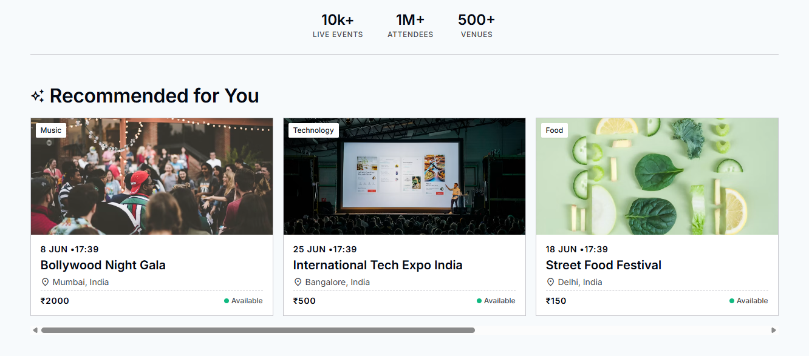
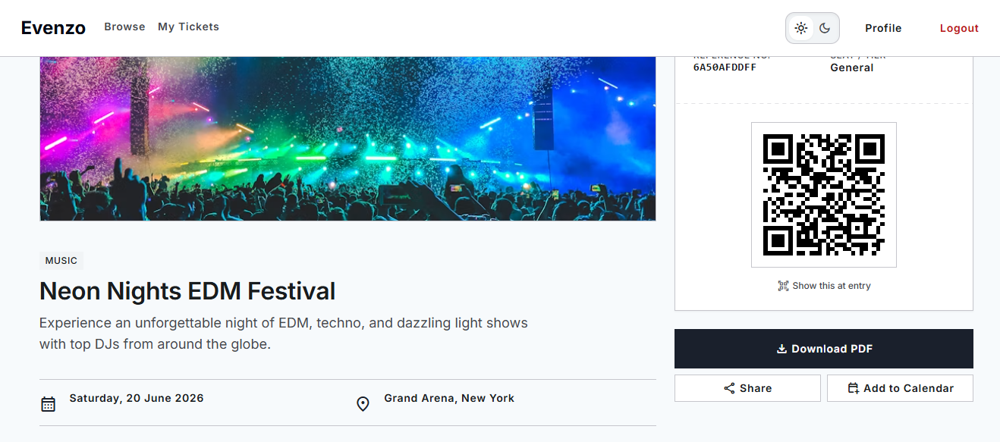
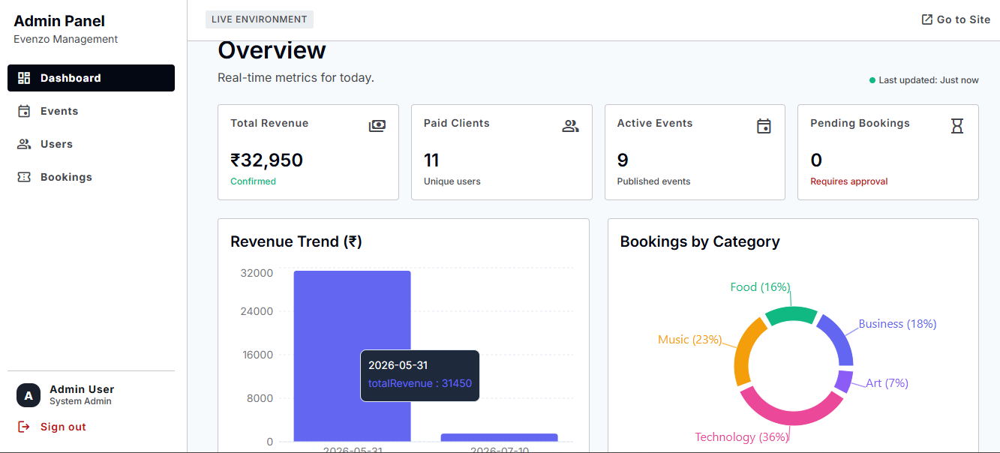
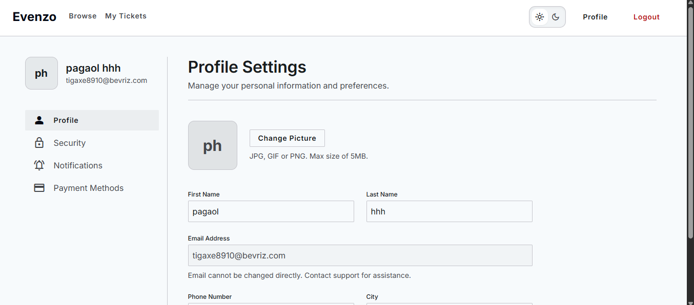

<div align="center">
  
</div>

<div align="center">
  
  []()
  []()
  []()
  []()
  []()

</div>

<h2 align="center">🎟️ Beyond a Standard CRUD App</h2>

<p align="center">
  <strong>Evenzo</strong> is a full-stack MERN event booking platform engineered to solve real-world ticketing challenges. From preventing double-booking to managing automated waitlists and ensuring secure entry with QR-based e-tickets, Evenzo is built for scale and reliability.
</p>

---

## ✨ Standout Features

🔥 **Real-time Seat Locking**  
Uses **Socket.io** to put a 10-minute hold on a seat the moment a user begins checkout. If abandoned, the seat instantly becomes available for others—no double booking, ever.

⏳ **Automated Redis Waitlist**  
Sold out? No problem. Users can join a waitlist backed by **Redis**. When a cancellation occurs, the system automatically promotes the next person in line and notifies them via email.

📱 **QR Code E-Ticketing**  
Automatically generates and emails PDF tickets with cryptographically secure, unique QR codes. Admins can scan these at the venue gate to validate entry and prevent ticket fraud.

🧠 **Smart Recommendations**  
A custom Node.js recommendation engine that analyzes past bookings to suggest upcoming events users actually care about.

📊 **Interactive Admin Dashboard**  
A sleek, real-time control panel built with **Recharts** to monitor revenue streams, peak booking hours, and overall event popularity.

---

## 🛠️ Tech Stack

| Domain | Technologies |
| :--- | :--- |
| **Frontend** | React (Vite), Tailwind CSS, Recharts |
| **Backend** | Node.js, Express.js |
| **Database** | MongoDB (Mongoose) |
| **Cache / Queues** | Redis |
| **Real-time** | Socket.io |

---

## 📸 Sneak Peek

### Home Page


### E-Ticket & QR Code


### Admin Dashboard


### User Profile


---

## 🚀 Quick Start (Local Setup)

Want to run Evenzo locally? Follow these simple steps.

**1. Clone the repository**
```bash
git clone https://github.com/rohitt-mahato/Evenzo_app.git
cd Evenzo-MERN
```

**2. Install dependencies**
This command installs packages for both frontend and backend simultaneously.
```bash
npm run install:all
```

**3. Environment Variables**
Create a `.env` file in the `server` directory using `.env.example` as a template.
```env
MONGO_URI=your_mongodb_connection_string
REDIS_URL=your_redis_url # (Optional, but enables the waitlist feature)
JWT_SECRET=your_jwt_secret
EMAIL_USER=your_email_address
EMAIL_PASS=your_email_app_password
```

**4. Fire it up!**
Start both the React client and Express server with one command.
```bash
npm run dev
```

*(Optional) Seed the database with dummy events:*
```bash
npm run seed --prefix server
```

---

<div align="center">
  <p>Built with ❤️ by <b>Rohit Mahato</b></p>
  <a href="https://github.com/rohitt-mahato">
    
  </a>
  <a href="https://www.linkedin.com/in/rohittmahato/">
    
  </a>
</div>
